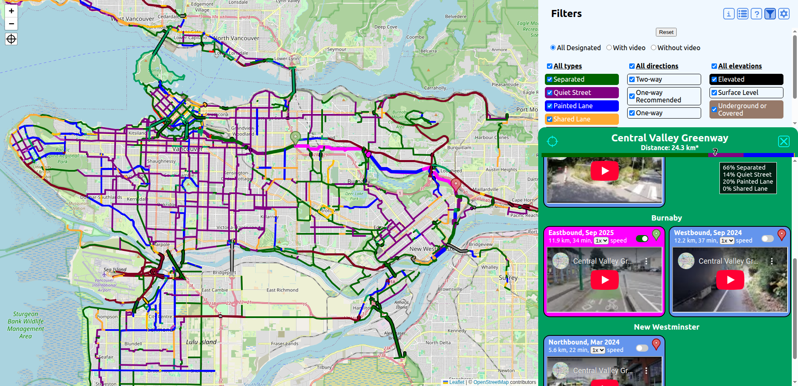

# Bike Route Map

This is a single-page application which shows a map of (Metro) Vancouver with bike routes highlighted and relevant information/context, including videos when available.

## Use

On GitHub Pages at [https://kr-matthews.github.io/bike-route-map](https://kr-matthews.github.io/bike-route-map).

## Features

### Current

- View named bike routes on zoom-able map.
- Distinguish between types of bike infrastructure (comfortable, painted lane, shared lane with cars, highway shoulder, narrow sidewalk).
- Bridges and tunnels/undercover routes visually distinct.
- Select a route to see information and embedded YouTube video(s) (if available).
- Explanatory legend.

### Potential Future

See [enhancements](https://github.com/kr-matthews/bike-route-map/issues?q=is%3Aissue+is%3Aopen+label%3Aenhancement) on GitHub.

- Ability to filter what types of infrastructure are shown (that is, filter to only show comfortable segments).
- More routes in surrounding cities/areas.

## Original Intentions

Quick, clean, and simple implementation of a map with an easy-to-use data layer on top. Something of practical use to someone cycling in and around Vancouver.

## Focus

- Separation of data and logic.
- Clean code.
- Avoiding perfection when drawing out routes - add just enough to prevent any ambiguity or potential confusion.

## Flaws

See the [issues](https://github.com/kr-matthews/bike-route-map/issues) on GitHub, in addition to the following:

- UI is far from perfect, and potentially unintuitive in places.
- Data is all hard-coded into the frontend, rather than utilizing some sort of database.
- There are not enough tests.
- Unclear when an area has additional bike routes but they just haven't been added to this map (yet).
- Data can easily get out-of-date.
